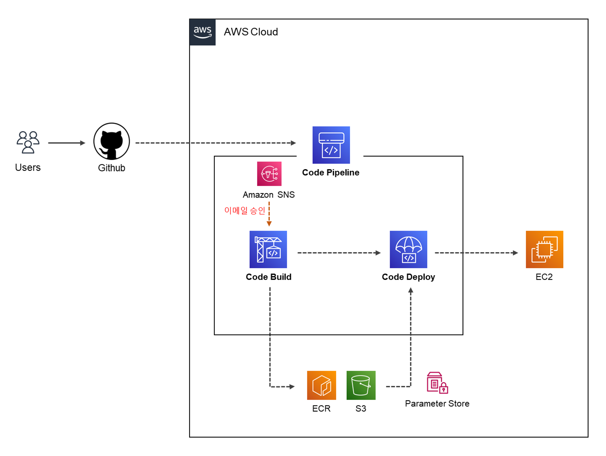

## AWS PIPELINE 구성

---

코드 수정에 따른 배포 과정을 자동화 하기 위해서 `AWS PIPELINE`을 사용하여 배포를 자동화 구성하였다.

여기서 진행하는 CI/CD 자동화 파이프라인을 구성을 위해서  
`GIT (main push)` - `Amazone SNS (Y/N)` - `CODE BUILD` - `[Elastic Container Registry]` `[S3]` `[Parameter Store]` - `CODE DEPLOY` - `EC2`   을 사용하였다.

---
### 진행과정

1. 유저가 소스 수정 후 저장소 `GITHUB` 에 `PUSH` 하게되면 `PIPELINE` 에서 트리거를 인식하여 이벤트를 실행
2. 파이프라인 트리거가 실행되면 `Amazone SNS` 를 이용한 Approval 스테이지를 진행
    - 구독중인 Email 로 해당 스테이지의 진행 여부 (승낙 / 거절) 메일을 전송
3. 소스 코드를 `CODE BUILD` 에서 빌드하고, 아티팩트를 `S3` 에 저장
    - 애플리케이션 빌드는 `Docker Image` 로 빌드하여 `ECR` 에 업로드
        - `buildspec.yml` 파일 환경변수는 `CODE BUILD` 생성시 설정
        - 컨테이너 이미지는 `Multi-stage build` 적용하여 필요없는 빌드환경을 제거
    - 배포과정에 사용될 `artifacts` 파일들을 `S3 버킷`에 저장
4. 빌드가 성공하면 `CODE DEPLOY` 에서 아티팩트 `"appspec.yml"` 파일을 확인하여 배포를 실행
    - 스크립트에서 사용되는 환경변수는  `AWS Parameters Store` 사용하여 값을 구성
    - 스크립트 내용에 따라 `ECR` 에서 이미지를 빌드하고 `"docker-compose.yml"` 파일을 실행
5. 해당 EC2 에 배포가 완료되면 애플리케이션 실행..

---

# INDEX

1. [CODE BUILD. 구성](/md/AWS/자동화%20파이프라인%20구축/CodeBuild 사용.md)
2. [CODE DEPLOY. 구성](/md/AWS/자동화%20파이프라인%20구축/CodeDeploy%20사용.md)
3. [CODE PIPELINE. 구성](/md/AWS/자동화%20파이프라인%20구축/CodePipeline%20사용.md)

- [오류 해결1](/md/AWS/자동화%20파이프라인%20구축/img/경험한%20오류%20정리.md#시행착오-겪은-error01)
- [오류 해결2](/md/AWS/자동화%20파이프라인%20구축/img/경험한%20오류%20정리.md#시행착오-겪은-error02)

---