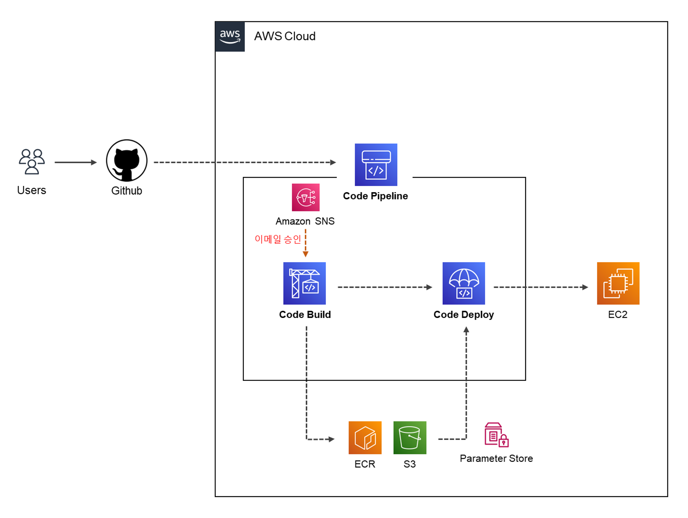

## AWS PIPELINE


코드 수정에 따른 배포 과정을 자동화 하기 위해서 `AWS PIPELINE`을 사용하여 배포를 자동화 구성하였다.  

진행 순서 : `GIT (main push)` - `Amazone SNS (Y/N)` - `CODE BUILD` - `[Elastic Container Registry]` `[S3]` `[Parameter Store]` - `CODE DEPLOY` - `EC2`

1. 유저가 소스 수정 후 저장소 `GITHUB` 에 `PUSH` 하게되면 `PIPELINE` 에서 트리거를 인식하여 이벤트를 실행
2. 파이프라인 트리거가 실행되면 `Amazone SNS` 를 이용한 Approval 스테이지를 진행
   - 구독중인 Email 로 해당 스테이지의 진행 여부 (승낙 / 거절) 메일을 전송
3. 소스 코드를 `CODE BUILD` 에서 빌드하고, 아티팩트를 `S3` 에 저장
   - 애플리케이션 빌드는 `Docker Image` 로 빌드하여 `ECR` 에 업로드
     - `buildspec.yml` 파일 환경변수는 `CODE BUILD` 생성시 설정
     - 컨테이너 이미지는 `Multi-stage build` 적용하여 필요없는 빌드환경을 제거
   - 배포과정에 사용될 `artifacts` 파일들을 `S3 버킷`에 저장
4. 빌드가 성공하면 `CODE DEPLOY` 에서 아티팩트 `"appspec.yml"` 파일을 확인하여 배포를 실행
   - 스크립트에서 사용되는 환경변수는  `AWS Parameters Store` 사용하여 값을 구성
   - 스크립트 내용에 따라 `ECR` 에서 이미지를 빌드하고 `"docker-compose.yml"` 파일을 실행
5. 해당 EC2 에 배포가 완료되면 애플리케이션 실행

---

# INDEX

1. [CODE BUILD](#code-build-진행)
2. [CODE DEPLOY](#code-deploy-진행)
3. [CODE PIPELINE](#code-pipeline-진행)

- [오류 해결1](#시행착오-겪은-error01)
- [오류 해결2](#시행착오-겪은-error02)

---
### 

---


---

---


오류 : exec /usr/local/openjdk-11/bin/java: exec format error

#### Ubuntu Server에 CodeDeploy 에이전트를 설치
```
sudo apt update -y
sudo apt install ruby-full -y
sudo apt install wget
cd /home/ubuntu
wget https://aws-codedeploy-ap-northeast-2.s3.ap-northeast-2.amazonaws.com/latest/install
chmod +x ./install
sudo ./install auto
```
서비스 실행중인지 확인 : sudo service codedeploy-agent status
sudo service codedeploy-agent start
sudo service codedeploy-agent status

---

---


---

#### Parameter Store

>`aws ssm get-parameter --name /account/config/region --with-decryption` 사용시 결과값


- `aws ssm get-parameter` 명령어를 통해 파라미터를 조회 할 수 있다.
- `--name` 태그를 이용하여 특정 값을 가져올 수 있다.
- 파라미터 유형이 문자열 값은 상관 없지만 보안 문자열을 사용시에는 `--with-decryption`를 통해 복호화된 값을 볼 수 있다.
- `aws ssm get-parameter --name /**/** --query 'Parameter.Value' --output text --with-decryption`사용하면 값만 추출가능
- sudo snap install aws-cli --classic


---

애플리케이션을 이미지로 빌드하여 사용시 꽤 큰 용량의 이미지 크기를 가지게 된다...

기존 도커 이미지 빌드
```dockerfile
# APP
FROM openjdk:11.0-slim

WORKDIR /app
#   현재 경로의 파일들을 "WORKDIR" 위치로 복사
COPY . .
#   권한설정 & jar build
RUN chmod +x ./gradlew
RUN ./gradlew clean build

#  (jar/war) 파일 위치 설정
ENV JAR_FILE=./build/libs/*-SNAPSHOT.war

RUN mv ${JAR_FILE} /app/app.war

ARG JA_SECRET
ENV JASYPT_SECRETE_KEY=${JA_SECRET}
ENV TZ=Asia/Seoul
ENV DB_URL_ADDRESS=mariaDB

ENTRYPOINT ["java", "-jar", "-Dspring.profiles.active=prod", "app.war"]
```

멀티스테이지 빌드

```dockerfile
# Build Stage
FROM openjdk:11.0-slim AS build
WORKDIR /app
COPY . .
RUN chmod +x ./gradlew
RUN ./gradlew clean build

# Final Stage
FROM openjdk:11.0-slim
WORKDIR /app
COPY --from=build /app/build/libs/*-SNAPSHOT.war /app/app.war

ARG JA_SECRET
ENV JASYPT_SECRETE_KEY=${JA_SECRET}
ENV TZ=Asia/Seoul
ENV DB_URL_ADDRESS=mariaDB

ENTRYPOINT ["java", "-jar", "-Dspring.profiles.active=prod", "app.war"]
```